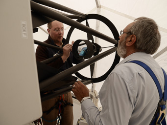
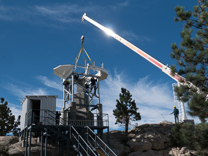

# COATLI: Gallery

These works are licensed under a [Creative Commons Attribution-ShareAlike 4.0 International License](https://creativecommons.org/licenses/by-sa/4.0/).

This is how the COATLI telescope looks in 2018. We've removed the primary mirror
covers to reduce wind shake. Because of this, we now park the telescope
pointing to the northern horizon, to keep dust off the mirrors.

* [Full Resolution](gallery/20180607T095734.jpg)
* Copyright (c) 2018 Alan M. Watson

Carlos Tejada cleaning the primary mirror with CO2.

* [Full Resolution](gallery/20180125T171114.jpg)
* Copyright (c) 2018 Alan M. Watson

<a name="interim-instrument"/>

The [interim instrument](interim-instrument.html), a simple CCD imager with a filter wheel.

* [Full Resolution](gallery/20171026T164215.jpg)
* Copyright (c) 2017 Alan M. Watson

The COATLI telescope with Orion in the background.

* [Full Resolution](gallery/20170403T194720.jpg)
* Copyright (c) 2017 Alan M. Watson

The COATLI enclosure (right) and the 84-cm dome (left) seen from the south.

* [Full Resolution](gallery/20170403T180504.jpg)
* Copyright (c) 2017 Alan M. Watson

COATLI at sunset.

* [Full Resolution](gallery/20170403T185907.jpg)
* Copyright (c) 2017 Alan M. Watson

<a name="inspecting-at-sunset"/>

Inspecting the telescope and platform at sunset.

* [Full Resolution](gallery/20170402T195542.jpg)
* Copyright (c) 2017 Alan M. Watson

The enclosure open and the telescope taking flats.

* [Full Resolution](gallery/20170402T185617.jpg)
* Copyright (c) 2017 Alan M. Watson

Rosalía Langarica-Liebre (left), Alan Watson (center), and Fernando Ángeles (left) adjusting the telescope balance on the mount.

* [Full Resolution](gallery/20160918T152659.jpg)
* Copyright (c) 2016 Rosa Becerra-Godínez

Alan Watson (left) and Carlos Tejada (right) inspecting the filter wheel prior to installation.

* [Full Resolution](gallery/20160918T111541.jpg)
* Copyright (c) 2016 Rosa Becerra-Godínez

Josef Huber (left) and Carlos Tejada (right) performing a coarse alignment of the telescope.

* [Full Resolution](gallery/20160917T120707.jpg)
* Copyright (c) 2016 Rosa Becerra-Godínez

Lifting the telescope onto the platform.

* [Full Resolution](gallery/20160915T151653.jpg)
* Copyright (c) 2016 Rosa Becerra-Godínez

Mating the platform to the tower.

* [Full Resolution](gallery/20160914T084504.jpg)
* Copyright (c) 2016 Rosa Becerra-Godínez

Lifting the platform onto the tower.

* [Full Resolution](gallery/20160914T084800.jpg)
* Copyright (c) 2016 Rosa Becerra-Godínez

Assembling the steel tower and platform.

* [Full Resolution](gallery/20160910T084929.jpg)
* Copyright (c) 2016 Alan M. Watson

The installations in May 2016.

* [Full Resolution](gallery/20160504T160631.jpg)
* Copyright (c) 2016 Alan M. Watson

The telescope pier in February 2016.

* [Full Resolution](gallery/20160221T111959.jpg)
* Copyright (c) 2016 Alan M. Watson

Salvador Cuevas (right) and Oscar Chapa (left) inspect the eventual
COATLI site during the site selection process in May 2014. The site is on a rocky
outcrop to the south of the existing 84-cm telescope. The white mast is
for the observatory's all-sky camera.

Videos of COATLI 

[Gaceta UNAM](https://www.youtube.com/watch?v=nRcT96wg77c)

* [Full Resolution](gallery/20140507T125046.jpg)
* Copyright (c) 2014 Alan M. Watson
