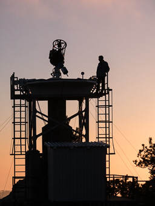

# COATLI

COATLI is a robotic 50-cm telescope at the [Observatorio
Astronómico Nacional](http://www.astrossp.unam.mx) in Mexico.

COATLI is currently operating with the HUITZI f/8 instrument, a EMCCD with a field of view of 11.9 &times; 11.9 arcmin with <i>griz</i> broad-band filters and 470/10, 640/10, and 656/3 narrow-band filter. However, our medium-term aim is to install a fast-guiding imager which will provide 0.35 arcsec FWHM images over a field of at least 4 arcmin and coverage of a large fraction of the sky.

For more details, see our article Watson et al. 2016, Proc. SPIE, 9908, 990850: "COATLI: an all-sky robotic optical imager with 0.3 arcsec image quality" 
([ADS](http://adsabs.harvard.edu/abs/2016SPIE.9908E..5OW)|[SPIE](https://www.spiedigitallibrary.org/conference-proceedings-of-spie/9908/1/COATLI--an-all-sky-robotic-optical-imager-with-03/10.1117/12.2233000.short?SSO=1)|[Local](watson-2016.pdf)).

* [Status](status.html)
* [News](news-2021.html)
* Technical Information
  - [Telescope](telescope.html)
  - [Interim Instrument](interim-instrument.html)
* Proposals
  - [Shared Risk Observations](shared-risk-observations.html)
* Using Data
  - [Acknowledgements in Publications](acknowledgements.html)
* [Publications and Theses](publications.html)
* [Gallery](gallery.html)
* [Participants](participants.html)

COATLI is a collaboration between:

* [Instituto de Astronomía](http://www.astroscu.unam.mx) [UNAM](http://www.unam.mx)
* [Arizona State University](https://sese.asu.edu/about)

with funding from:

* [CONACyT](http://www.astroscu.unam.mx/)
* [UNAM](http://www.unam.mx)

COATLI is lead by:

* Alan Watson (Principal Investigator and Project Manager)
* Salvador Cuevas (Project Engineer)
* Diego González (Project Scientist)
