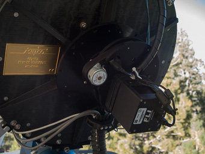

# COATLI: Interim Instrument

The interim instrument is a simple CCD imager with filters.

## Detector

The detector is FLI ML3200 with a Kodak KAF-3200ME CCD. 

The field is 12.8&nbsp;&times;&nbsp;8.7 arcmin with the long axis roughly N-S. The detector can be binned and windowed. Table 1 gives the format and pixel scale for binning 1&nbsp;&times;&nbsp;1 and 2&nbsp;&times;&nbsp;2.

Table 1: Detector Format and Scale

<table>
<tr><th>Binning</th><th>Photoactive Pixels</th><th>Pixel Size</th><th>Pixel Size</th></tr>
<tr></th><th>(px)</th><th>(px)</th><th>(µm)</th><th>(arcsec)</th></tr>
<tr><td>1 &times; 1</td><td>2184 &times; 1472</td><td>6.8</td><td>0.351</td></tr>
<tr><td>2 &times; 2</td><td>1092 &times; 736</td><td>13.6</td><td>0.702</td></tr>
</table>

The detector has two read modes (1 and 6 MHz). Table 2 shows the read-out parameters as functions of binning and read mode.

Table 2: Detector Read-Out Parameters

<table>
<tr><th>Binning</th><th>Read Mode</th><th>Read Noise</th><th>Gain</th><th>Read Time</th></tr>
<tr><th>(px)</th><th>(MHz)</th><th>(e)</th><th>(e/DN)</th><th>(s)</th></tr>
<tr><td>1 &times; 1</td><td>1</td><td>9.4</td><td>6.3</td><td>4.0</td></tr>
<tr><td>2 &times; 2</td><td>1</td><td>10.7</td><td>6.2</td><td>3.9</td></tr>
<tr><td>1 &times; 1</td><td>6</td><td>19.5</td><td>6.4</td><td>1.2</td></tr>
<tr><td>2 &times; 2</td><td>6</td><td>25.8</td><td>6.4</td><td>1.0</td></tr>
</table>

The ADC saturates at 8k DN.

For science applications, we currently typically read the detector at 1 MHz (for lower noise), binned 2&nbsp;&times;&nbsp;2 (since the telescope currently has [image quality problems](telescope.html#problems)), and unwindowed. The 6 MHz mode and windowing might be useful for applications which require less overhead and are not limited by read noise. Binning 1&nbsp;&times;&nbsp;1 might be useful for applications which are limited by the bright limit.

The detector has good peak quantum efficiency in 550-700 nm but is poor to the blue of 400 nm and to the red of 800 nm.

The detector is typically cooled to -30 C. The median dark current at this temperature is about 0.005 e/s/px, but there is a tail of hot pixels. About 6700 pixels (0.21%) have dark currents of 0.1 e/s/px or more, about 237 pixels (0.0072%) have dark currents of 1 e/s/px or more, and about 27 pixels (0.00084%) have dark currents of 10 e/s/px or more.

## Filters

The interim instrument has an FLI CFW-1-5 filter wheel equipped with <i>BVRI</i> filters and a clear <i>w</i> filter.

* The <i>BVRI</i> filters are Bessell filters supplied by Custom Scientific. 

* The <i>w</i> filter is an Edmund Optics fused silica window with VIS-NIR coatings (part number #84-458).

All filters are 50 mm in diameter and 5 mm thick.

## Efficiency

Firgure 1 shows the estimated system efficiencies -- including the atmosphere at an airmass of 1.5, telescope, and instrument. 

Figure 1. The estimated system efficiency.

The efficiency in <i>w</i> below 380 nm is uncertain. The AR coating on the filter is optimized for 400 nm and above, and we have no data on its performance below 380 nm.

Table 3 gives the pivot wavelengths of the filters, defined by equation (A16) of [Bessell & Murphy (2012)](https://ui.adsabs.harvard.edu/#abs/2012PASP..124..140B/abstract).

Table 3: Filter Pivot Wavelengths

<table>
<tr><th>Filter</th><th>Pivot Wavelength</th></tr>
<tr><th></th><th>(nm)</th></tr>
<tr><td><i>B</i></td><td>439</td></tr>
<tr><td><i>V</i></td><td>539</td></tr>
<tr><td><i>R</i></td><td>635</td></tr>
<tr><td><i>I</i></td><td>819</td></tr>
<tr><td><i>w</i></td><td>630</td></tr>
</table>

## Zero-Points and Transformations

Table 4 gives the zero-points for the filters, the count rates in electron/second for a magnitude zero star. The magnitude system is Vega-based for <i>BVRI</i> and AB for <i>w</i>.

Table 4: Filter Zero-Points

<table>
<tr><th>Filter</th><th>Zero-Point</th><th>Magnitude Type</th></tr>
<tr><td><i>B</i></td><td>4.6 &times; 108</td><td>Vega</td></tr>
<tr><td><i>V</i></td><td>4.8 &times; 108</td><td>Vega</td></tr>
<tr><td><i>R</i></td><td>5.7 &times; 108</td><td>Vega</td></tr>
<tr><td><i>I</i></td><td>2.8 &times; 108</td><td>Vega</td></tr>
<tr><td><i>w</i></td><td>2.4 &times; 109</td><td>AB</td></tr>
</table>

For normal stars, the AB <i>w</i> magnitude is given in terms of the SDSS <i>g</i> and <i>r</i> magnitudes by

<i>w</i> - <i>r</i> ≈ 0.12 (<i>g</i> - <i>r</i>).

That is, <i>w</i> is effectively slightly bluer than SDSS <i>r</i>.

