# COATLI: News for 2018

* [Observations and Detection of GRB 181201A](#20181202)
* [Early Observations and Detection of GRB 180812A](#20180812)
* [Observations and Detection of GRB 180806A](#20180807)
* [Observations of GRB 180805B](#20180806)
* [First COATLI Science Paper Submitted!](#20180802)
* [Observations and Detection of GRB 180720B](#20180722)
* [Observations of GRB 180715A](#20180716)
* [Early Observations of GRB 180709A](#20180709)
* [Early Observations and Detection of GRB 180706A](#20180706)
* [Early Observations and Detection of GRB 180626A](#20180626)
* [The Mysterious Transient AT2018cow/ATLAS18qqn](#20180621)
* [Early Observations and Detection of GRB 180620A](#20180620)
* [Shutter Failure](#20180418)
* [Early Observations and Detection of GRB 180205A](#20180205)

<a name="20180807"/>
## Observations and Detection of GRB 181201A

02 December 2018

Last night we observed the field of the long gamma-ray burst GRB 181201A which was
[detected](https://gcn.gsfc.nasa.gov/gcn3/23469.gcn3) by the INTEGRAL satellite.

This was not one of our quick responses. The GRB occurred at the start of the previous night, but we were closed because of threatening low clouds and did not open until after it had set. 

The optical counterpart was initially very bright: it was [observed](https://gcn.gsfc.nasa.gov/gcn3/23470.gcn3) at about magnitude 13.2  at very early times by colleagues using a telescope in Argentina.

We were able to observe it on the second night from 23 to 25 hours after the burst. We detected the optical counterpart at a magnitude of  <i>w</i>&nbsp;=&nbsp;17.8, and
reported this in a [GCN Circular](https://gcn.gsfc.nasa.gov/gcn3/23481.gcn3).

<a name="20180812"/>
## Early Observations and Detection of GRB 180812A

12 August 2018

Last night we observed the optical counterpart of the long gamma-ray burst GRB 180812A which was
[detected](https://gcn.gsfc.nasa.gov/gcn3/23129.gcn3) by the Neil
Gehrels Swift Observatory.

COATLI slewed quickly to the burst coordinates, and our first exposure
started 43.1 seconds after the burst detection or 11.6 seconds after
receiving the automatic alert.

The counterpart was bright, and we detected it in our first few images at <i>w</i>&nbsp;≈&nbsp;17.4, brightening gradually to <i>w</i>&nbsp;≈&nbsp;17.2 at about 160 seconds, and then fading rapidly. We reported our results in a [GCN Circular](https://gcn.gsfc.nasa.gov/gcn3/23132.gcn3).

<a href="news/2018/20180812-grb-180812a.jpg">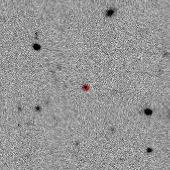</a>

Our image of the field of GRB 180812A. The red circle is the region with a 90% probability of containing the GRB, derived from Swift/XRT detection. We detect the optical counterpart. The image is about 2 arcmin
to a side.

This burst could not have been observed by our sister project [RATIR](http://ratir.astroscu.unam.mx/) because of its northern declination (+75 degrees). However, it was [observed](https://gcn.gsfc.nasa.gov/gcn3/23130.gcn3) by the BOOTES-5/JGT telescope also at the Observatorio Astronómico Nacional starting about 10 seconds after our observations.

<a name="20180807"/>
## Observations and Detection of GRB 180806A

07 August 2018

Most of our observations of gamma-ray bursts are initiated automatically when the COATLI control system receives a automatic notification from the [Neil
Gehrels Swift Observatory](https://swift.gsfc.nasa.gov). 

Our observations of GRB 180806A last night were exceptional. One of our team members woke up early and checked email. There was a message from our colleague Vladimir Lipunov noting that his team had [found](https://gcn.gsfc.nasa.gov/gcn3/23091.gcn3) a possible optical counter part to a gamma-ray burst [detected](https://gcn.gsfc.nasa.gov/other/555287944.fermi) by the [Fermi Gamma-ray Space Telescope](https://fermi.gsfc.nasa.gov). Our team member immediately interrupted routine observations and programmed an observation of the possible counterpart.

We detected the counterpart at <i>w</i>&nbsp;=&nbsp;20.0&nbsp;&pm;&nbsp;0.2 (later refined to <i>w</i>&nbsp;=&nbsp;20.22&nbsp;&pm;&nbsp;0.05) and confirmed fading compared to Lipunov's earlier observation. We reported our results in a [GCN Circular](https://gcn.gsfc.nasa.gov/gcn3/23092.gcn3).

Subsequent observations in X-rays by Swift [confirmed](https://gcn.gsfc.nasa.gov/gcn3/23097.gcn3) that this indeed was the counterpart of GRB 180606A.

<a href="news/2018/20180807-grb-180806a.jpg">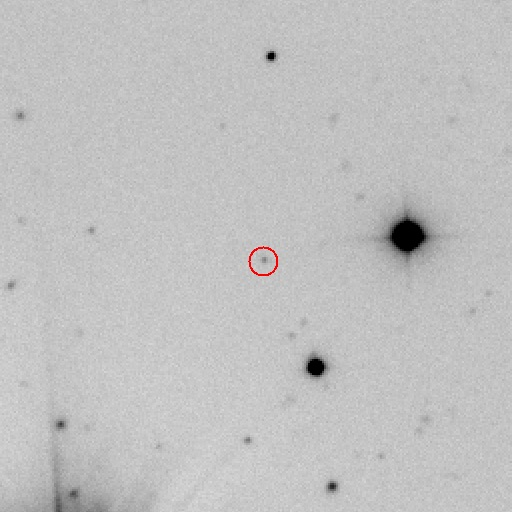</a>

Our image of the possible counterpart of GRB 180806A. The red circle shows the position of the possible counterpart found by the MASTER team. The image is about 3 arcmin
to a side.

<a name="20180806"/>
## Observations of GRB 180805B

06 August 2018

Last night we observed the field of the short gamma-ray burst GRB 180805B which was
[detected](https://gcn.gsfc.nasa.gov/gcn3/23076.gcn3) by the Neil
Gehrels Swift Observatory. 

This was not one of our quick responses; the GRB occurred just after sunrise in Mexico, so our observations were from 19 to 23 hours after the burst. 

We did not detect any optical counterpart to a limiting magnitude of  <i>w</i>&nbsp;&gt;&nbsp;22.5 (5<i>&sigma;</i>), and
reported this in a [GCN Circular](https://gcn.gsfc.nasa.gov/gcn3/23089.gcn3).

<a href="news/2018/20180806-grb-180805b.jpg">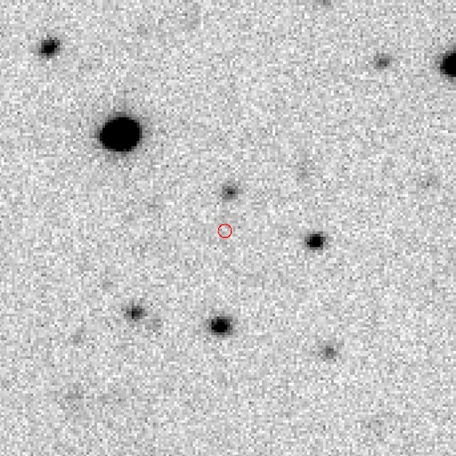</a>

Our image of the field of GRB 180805B. The red circle is the region with a 90% probability of containing the GRB, derived from Swift/XRT detection. The image is about 2 arcmin
to a side.

<a name="20180802"/>
## First COATLI Science Paper Submitted!

02 August 2018

The first paper containing COATLI science observations has been submitted to [MNRAS](https://academic.oup.com/mnras/) and [arXiv](https://arxiv.org/abs/1808.00969)! The paper is lead by Dan Perley and is an investigation into the mysterious transient AT2018cow. COATLI contributed photometry in <i>BVRI</i>.

<a name="20180722"/>
## Observations and Detection of GRB 180720B

22 July 2018

Last night we observed the optical counterpart of the long gamma-ray burst GRB 180720B which was
[detected](https://gcn.gsfc.nasa.gov/gcn3/22973.gcn3) by the Neil
Gehrels Swift Observatory.

The burst occurred shortly after sunrise in Mexico on 21 July 2018. The optical counterpart was initially very bright: it was [observed](https://gcn.gsfc.nasa.gov/gcn3/22977.gcn3) at <i>R</i>&nbsp;&approx;&nbsp;9.4 at very early times by colleagues using a telescope in Japan. We monitored the burst with COATLI on subsequent nights. We detected the optical counterpart in observations from 2018 July 22 at <i>w</i>&nbsp;=&nbsp;20.07&nbsp;&pm;&nbsp;0.02, and
reported this in a [GCN Circular](https://gcn.gsfc.nasa.gov/gcn3/23017.gcn3).

<a href="news/2018/20180722-grb-180720b.jpg">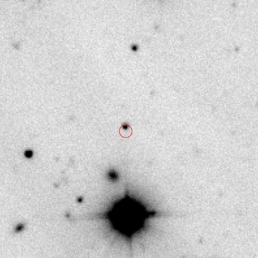</a>

Our image of the field of GRB 180720B. The red circle is the region with a 90% probability of containing the GRB, derived from Swift/XRT detection. We detect the optical counterpart, on the northern edge of the Swift/XRT region. The image is about 2.3 arcmin
to a side.

<a name="20180716"/>
## Observations of GRB 180715A

16 July 2018

Last night we observed the field of the short gamma-ray burst GRB 180715A which was
[detected](https://gcn.gsfc.nasa.gov/gcn3/22947.gcn3) by the Neil
Gehrels Swift Observatory.

Unusually, Swift was not able to quickly slew to the position of the GRB to observe in X-rays with XRT. Yet more unusually, once it was able to slew, no obvious X-ray counterpart was detected. However, XRT did detect five faint sources in the vicinity of the GRB, and one of these might correspond to the GRB afterglow. This result was [published](https://gcn.gsfc.nasa.gov/gcn3/22953.gcn3) almost 30 hours after the burst.

Our observations of GRB 180715A were not one of our quick responses; the GRB occurred during the day in Mexico, so our observations were from 10 to 14 hours after the burst. Furthermore, we initially weren't sure what they were telling us. With only BAT observations from Swift, the uncertainty in the position of the GRB is about 3 arcmin in radius (90%). We saw no bright source in that region, but the afterglow could have been hiding in the glare of the nearby magnitude 8 star HD 139840.

However, once the Swift team had [published](https://gcn.gsfc.nasa.gov/gcn3/22953.gcn3) the coordinates of the five faint X-ray sources, we were able to confirm that absence of coincident optical sources to <i>w</i>&nbsp;&gt;&nbsp;22.3 (5<i>&sigma;</i>), and
reported this in a [GCN Circular](https://gcn.gsfc.nasa.gov/gcn3/22954.gcn3).

<a href="news/2018/20180716-grb-180715a.jpg">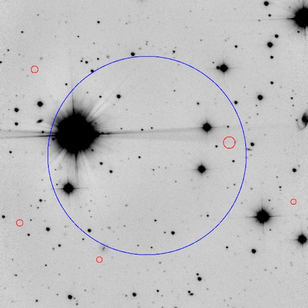</a>

Our image of the field of GRB 180715A. The blue circle is the region with a 90% probability of containing the GRB, derived from Swift/BAT detection. The five red circles are the Swift/XRT faint sources. The bright star is HD 139840. The image is about 9 arcmin to a side.

<a name="20180709"/>
## Early Observations of GRB 180709A

09 July 2018

Last night we observed the field of the long gamma-ray burst GRB 180709A which was
[detected](https://gcn.gsfc.nasa.gov/gcn3/22930.gcn3) by the Neil
Gehrels Swift Observatory.

COATLI slewed quickly to the burst coordinates, and our first exposure
started 65.4 seconds after the burst detection or 14.5 seconds after
receiving the automatic alert.

We did not detect the optical counterpart to a limiting magnitude of  <i>w</i>&nbsp;&gt;&nbsp;21.3 (3<i>&sigma;</i>), and
reported this in a [GCN Circular](https://gcn.gsfc.nasa.gov/gcn3/22934.gcn3).

<a href="news/2018/201807109-grb-180709a.jpg">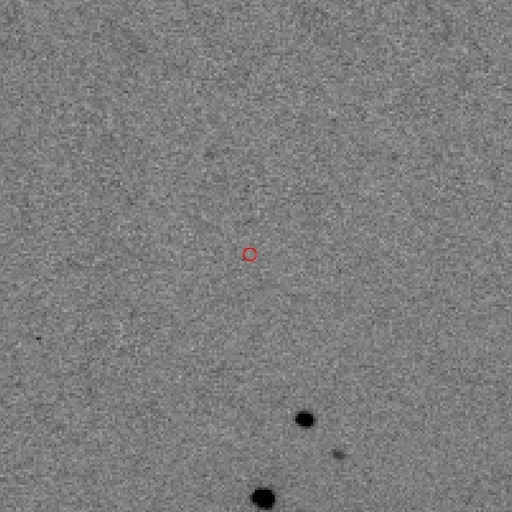</a>

Our image of the field of GRB 180719A. The red circle is the region with a 90% probability of containing the GRB, derived from Swift/XRT detection. We do not detect the optical counterpart. The image is about 2.4 arcmin to a side.

This burst could not have been observed by our sister project [RATIR](http://ratir.astroscu.unam.mx/) because of its northern declination (+60 degrees).

<a name="20180706"/>
## Early Observations and Detection of GRB 180706A

06 July 2018

July continues as June ended. Last night we observed the optical counterpart of the long gamma-ray burst GRB 180706A which was
[detected](https://gcn.gsfc.nasa.gov/gcn3/22909.gcn3) by the Neil
Gehrels Swift Observatory.

COATLI slewed quickly to the burst coordinates, and our first exposure
started 46.4 seconds after the burst detection or 29.5 seconds after
receiving the automatic alert.

The counterpart was bright, and we detected it in our first few images at <i>w</i>&nbsp;=&nbsp;18.73&nbsp;&pm;&nbsp;0.08, and
reported this in a [GCN Circular](https://gcn.gsfc.nasa.gov/gcn3/22910.gcn3). Fading was  [confirmed](https://gcn.gsfc.nasa.gov/gcn3/22923.gcn3) by colleagues using a [telescope in Kazakstan](https://en.wikipedia.org/wiki/Tien_Shan_Astronomical_Observatory).

<a href="news/2018/20180706-grb-180706a.jpg">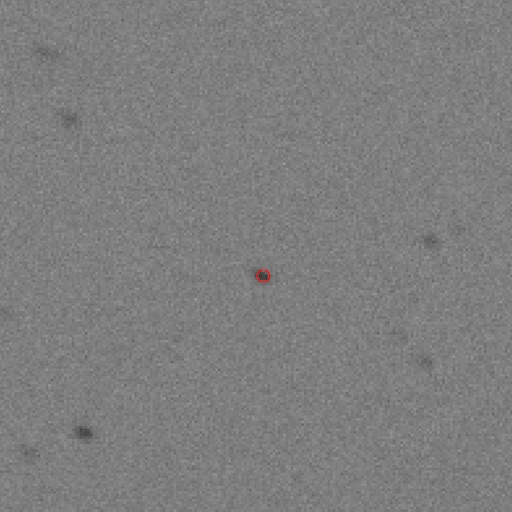</a>

Our image of the field of GRB 180706A. The red circle is the region with a 90% probability of containing the GRB, derived from Swift/XRT detection. We detect the optical counterpart. The image is about 2.3 arcmin
to a side.

Our observations of this burst were interesting for a couple of reasons.

First, the speed of our response. The burst was detected by Swift at 01:24 PDT. One of our team members was up working, and was able to confirm the detection in our real-time pipeline reduction at 01:44 PDT, even before we received the Swift [discovery GCN](https://gcn.gsfc.nasa.gov/gcn3/22909.gcn3) by email at 01:51 PDT. Nevertheless, we waited for the Swift GCN in order to confirm the identity and nature of this GRB, and sent our [GCN Circular](https://gcn.gsfc.nasa.gov/gcn3/22910.gcn3) at 02:03 PDT.

Second, the GRB occurred under the pole! We started observing at +66 degrees of declination and an hour angle of +7.5 hours and finished observations at an hour angle of +10.5 hours.

This burst could not have been observed by our sister project [RATIR](http://ratir.astroscu.unam.mx/) because of its northern declination (+66 degrees) and HA (+7.5 hours and increasing).

<a name="20180626"/>
## Early Observations and Detection of GRB 180626A
## 

26 June 2018

June contines to be a busy month. Last night we observed the optical
counterpart of the gamma-ray burst GRB 180626A which was
[detected](https://gcn.gsfc.nasa.gov/gcn3/22850.gcn3) by the Neil
Gehrels Swift Observatory.

COATLI slewed quickly to the burst coordinates, and our first exposure
started 33.7 seconds after the burst detection or 17.9 seconds after
receiving the automatic alert.

The counterpart was quite faint, but nevertheless we managed to obtain a
marginal detection at <i>w</i>&nbsp;=&nbsp;21.4&nbsp;&pm;&nbsp;0.9, and
reported this in a [GCN Circular](https://gcn.gsfc.nasa.gov/gcn3/22859.gcn3).
This is our deepest detection to date.

<a href="news/2018/20180626-grb-180626a.jpg">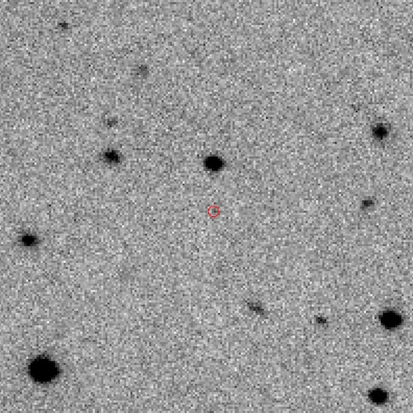</a>

Our image of the field of GRB 180626A. The red circle is the region with a 90% probability of containing the GRB, derived from Swift/XRT detection. We detect the optical counterpart. The image is about 2.3 arcmin
to a side.

The image quality is still degraded by wind shake and poor mirrors --
our final image had a FWHM of about 2.8 arcsec. Once we achieve
seeing-limited images we expect to be able to take images that are about
a factor of 3 deeper.

<a name="20180621"/>
## The Mysterious Transient AT2018cow/ATLAS18qqn

21 June 2018

Last night we observed the mysterious bright transient source
AT2018cow/ATLAS18qqn with COATLI. This transient was
[discovered](http://www.astronomerstelegram.org/?read=11727) by the
ATLAS group in a nearby galaxy at a distance of about 60 Mpc, and its
nature is not at all clear.

We detected the transient at <i>r</i>&nbsp;≈&nbsp;14.9, saw it fade by
about 0.1 magnitudes during the night, and have reported our
observations as an
[ATel](http://www.astronomerstelegram.org/?read=11751). We plan to keep
monitoring.

<a href="news/2018/20180621-18cow.jpg">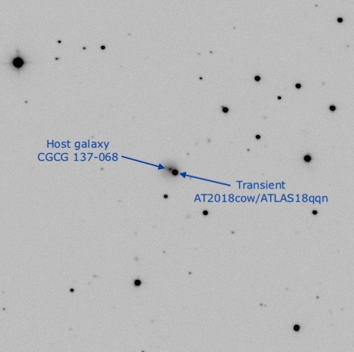</a>

Our image of the field of AT2018cow/ATLAS18qqn. The
image has about 30 minutes of exposure in <i>R</i> and is about 6 arcmin
to a side.

<a name="20180620"/>
## Early Observations and Detection of GRB 180620A

20 June 2018

Last night we observed the optical counterpart of the gamma-ray burst
GRB 180620A which was
[detected](https://gcn.gsfc.nasa.gov/gcn3/22798.gcn3) by the Neil
Gehrels Swift Observatory.

COATLI slewed quickly to the burst coordinates, and our first exposure
started 39.2 seconds after the burst detection or 21.1 seconds after
receiving the automatic alert.

We detected the counterpart at <i>w</i>&nbsp;≈&nbsp;17.5, saw a rapid
initial fade in brightness, then a flare, and then a slower fade during
the next three hours. We have reported our observations as a
[GCN Circular](https://gcn.gsfc.nasa.gov/gcn3/22806.gcn3).

<a href="news/2018/20180620-grb-180620a.jpg">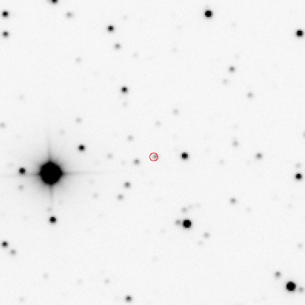</a>

Our image of the field of GRB 180620A. The red circle is the region with a 90% probability of containing the GRB, derived from Swift/XRT detection. We detect the optical counterpart. The image is about 2.3 arcmin
to a side.

We are writing a research article combining our early data with the
deeper data we [obtained](https://gcn.gsfc.nasa.gov/gcn3/22799.gcn3)
with [RATIR](http://ratir.astroscu.unam.mx).

<a name="20180418"/>
## Shutter Failure

18 April 2018

The shutter failed open on the night of 18 April 2018 UTC. Carlos Tejada
and Tomás Calvario checked it the next day and found that a spider had
taken up residence! After removing the spider, the shutter is working
normally again.

<a href="news/2018/20180418-spider.jpg">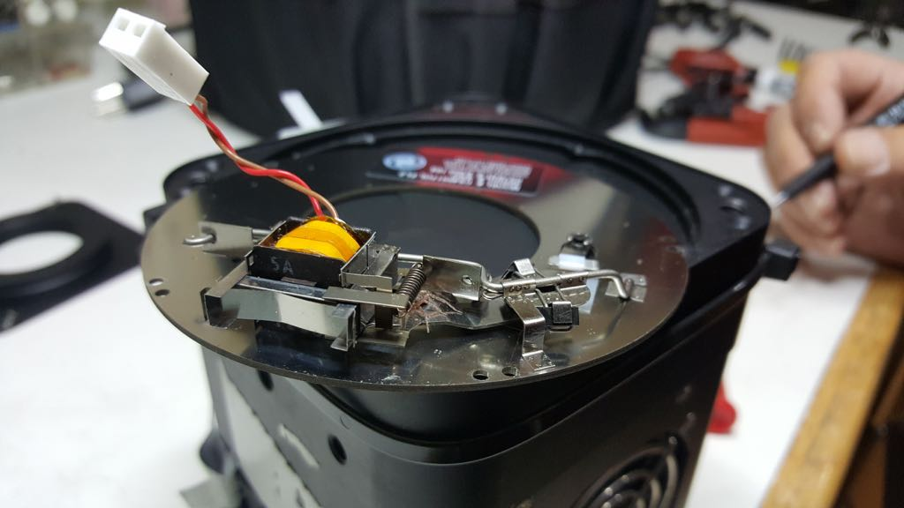</a>

The spider in the shutter.

<a name="20180205"/>
## Early Observations and Detection of GRB 180205A

5 February 2018

Last night we observed the optical counterpart of the gamma-ray burst
GRB 180205A with was
[detected](https://gcn.gsfc.nasa.gov/gcn3/22381.gcn3) by the Neil
Gehrels Swift Observatory.

COATLI slewed quickly to the burst coordinates, and our first exposure
started 6.5 seconds after receiving the automatic alert. Unfortunately,
a problem with satellite telemetry mean that the automatic alert was
delayed, so the first exposure started 212.8 seconds after the burst
detection.

We detected the counterpart at <i>w</i>&nbsp;≈&nbsp;15.6.

We are writing a research article comparing our optical data to the
X-ray and gamma-ray data obtained by Swift and Fermi.