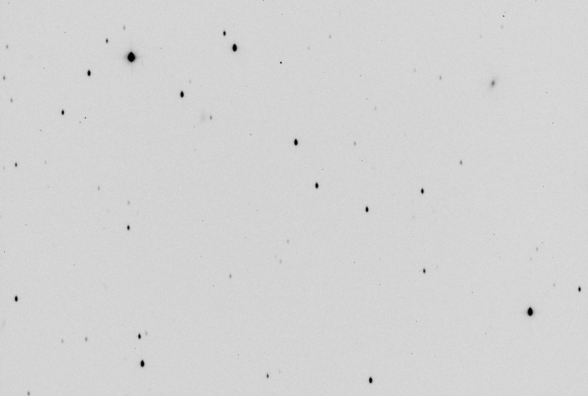
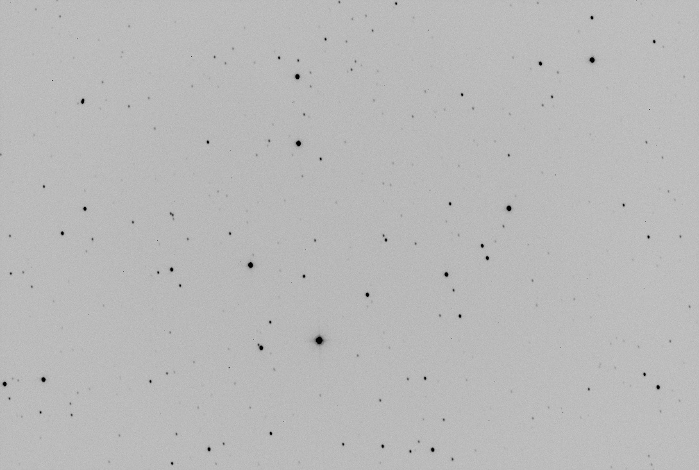

# COATLI: Telescope, Mount, and Enclosure

The COATLI telescope is an [ASTELCO Systems](http://www.astelco.com)
50-cm f/8
[Ritchey-Crétien](https://en.wikipedia.org/wiki/Ritchey–
Chrétien_telescope) reflector with protected aluminum coatings.

## Location

The telescope is located at the [Observatorio Astronómico
Nacional](http::/www.astrossp.unam.mx/) in the Sierra de San Pedro
Mártir in Baja California, México, at [31°02'42.2" N 115°27'57.4"
W](https://goo.gl/maps/R2xRbqwrjxA2) and at an altitude of 2800 meters.

## Tower

The telescope is installed on a concrete and steel tower on a rocky
outcrop. The telescope axes are about 6.2 meters above rocks and the
rocks are a similar height above the ground.

## Enclosure

The telescope is protected by an [ASTELCO
Systems](http://www.astelco.com) ARTS folding enclosure.

## Mount

The telescope mount is an [ASTELCO Systems](http://www.astelco.com)
NTM-500.

The telescope is mounted in a [German equatorial
configuration](https://en.wikipedia.org/wiki/Equatorial_mount#
German_equatorial_mount). Thus, to move from one side of the meridian to
the other, it needs to do a "meridian flip": move first in declination
to the pole and then move in HA to the other side.

One consequence of this is that the instrument rotates by 180 degrees
with respect to the sky as it moves from east to west. The mount
rotation is given by the SMTMRO and EMTMRO keywords in the FITS headers
of images.

The mount is fast; when slewing it accelerates at 10 deg/s2
to a velocity of 30 deg/s. Thus, the slew time typically less than 10
seconds between two points on the same side of the meridian but
typically 20-30 seconds between two points on different sides of the
meridian (because of the need to do a meridian flip).

The high slew speed gives COATLI two advantages compared to conventional
telescopes. One is that it can quickly respond to transient events such
as GRBs. The other is that it can rapidly move between many objects, for
example, to observe standard stars or to monitor galaxies for
transients.

## Pointing Limits

The telescope can point over the whole sky (including under the pole) to
a zenith distance of 85 degrees.

<a name="problems"/>
## Problems

The telescope and mount have two major problems that severely impact
image quality.

* The mount frequently shows vibrations with an amplitude of typically
  10 arcsec, apparently due to an instability in the mount control system.
  This problem affects about half of all pointings, apparently randomly.
  The vibrations appear to be stronger and more common in higher winds.

  For example, the image below (30 seconds in <i>R</i>) shows moderate
  vibrations of about 7 arcsec E-W (up-down). The vibrations are
  sometimes stronger and vary in direction.

  

  The manufacturer will perform on-site tuning at the end of May 2018,
  and we hope to resolve this problem.

* The telescope mirrors were misfigured and deliver 1.4 arcsec FWHM
  images even in the best conditions.

  For example, the image below (30 seconds in <i>R</i>) does not show
  strong vibrations and has with about 2.0 arcsec FWHM. This is a fairly
  typical.

  

  We are awaiting delivery and installation of a second set of mirrors
  from the manufacturer. We do not yet have a firm date, but we expect
  the optics to be installed in Fall 2018.

